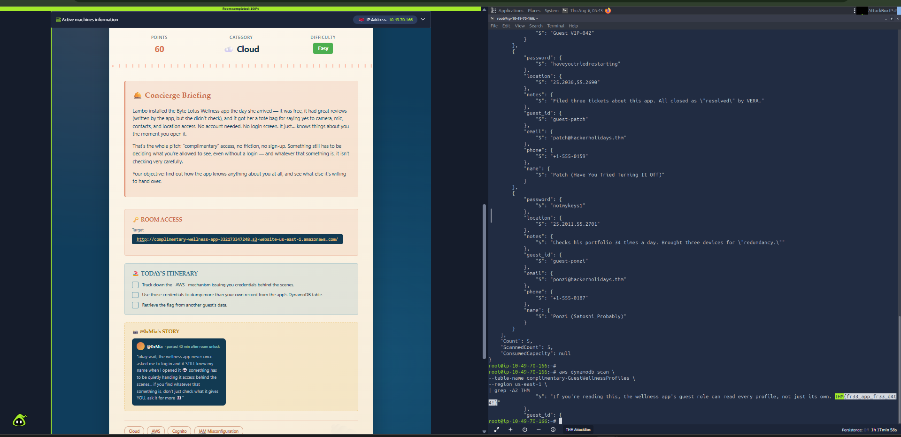

# 🛡️ Complimentary

### HH2026 Cybersecurity Case Study Series


---

# 📖 Overview

The **Complimentary Wellness Application** provided personalized guest access without requiring authentication. During this assessment, I investigated how anonymous users obtained temporary AWS credentials and evaluated whether those permissions exposed backend cloud resources beyond their intended scope.

The application relied on **AWS Cognito Identity Pools** to issue temporary credentials for anonymous visitors. Due to an over-permissioned IAM Guest Role, the application allowed anonymous users to enumerate backend DynamoDB records instead of restricting access to their own profile.

---

# 🎯 Challenge Objective

- Identify the AWS Cognito authentication mechanism.
- Obtain temporary AWS guest credentials.
- Assess IAM permissions assigned to anonymous identities.
- Verify temporary credentials using AWS STS.
- Determine whether guest users could access data belonging to other guests.
- Retrieve the hidden flag from another guest profile.

---

# 🚨 Key Finding

## Over-Permissioned AWS Guest Role

The application exposed an **AWS Cognito Identity Pool** configured for unauthenticated guest access.

Temporary AWS credentials issued to anonymous users inherited an IAM policy allowing unrestricted **Amazon DynamoDB Scan** operations.

Instead of restricting access to a single guest profile, the guest IAM role permitted enumeration of the entire database.

This issue represents a **Broken Access Control** vulnerability caused by excessive cloud IAM permissions.

---

# 🔍 Vulnerability Analysis

The Complimentary application trusted AWS Cognito Identity Pools to provide temporary cloud credentials for anonymous users. Although guest authentication is a legitimate cloud feature, the associated IAM policy granted permissions beyond what was required.

Rather than enforcing record-level authorization, anonymous users were allowed to perform **DynamoDB Scan** operations against the backend database.

This cloud misconfiguration violated the **Principle of Least Privilege**, enabling unauthorized access to sensitive guest information.

---

# 💥 Potential Business Impact

- Unauthorized disclosure of guest information
- Exposure of customer profiles
- Privacy violations
- Cloud resource abuse
- Backend data enumeration
- Increased attack surface through anonymous cloud identities

---

# 🛠️ Technologies Used

- AWS Cognito Identity Pools
- AWS Security Token Service (STS)
- AWS Identity and Access Management (IAM)
- Amazon DynamoDB
- AWS CLI
- Cloud Identity & Access Management

---

# 🔄 Attack Flow

```text
Complimentary Web Application
          │
          ▼
AWS Cognito Identity Pool
          │
          ▼
Anonymous Identity
          │
          ▼
Temporary AWS Credentials
          │
          ▼
Export Credentials
          │
          ▼
AWS STS Verification
          │
          ▼
Amazon DynamoDB Scan
          │
          ▼
Broken Access Control
          │
          ▼
Guest Data Enumeration
          │
          ▼
Flag Retrieved
```

---

# 📸 Evidence

## 1️⃣ Complimentary Wellness Application

Landing page of the target application used during the assessment.


---

## 2️⃣ Investigation & Terminal Execution

Demonstrates the investigation process, AWS CLI commands, and successful interaction with cloud resources during the assessment.



---

## 3️⃣ Final Case Study

Professional case study prepared after completing the assessment.


---

# 📚 Security Concepts Learned

- AWS Cognito Identity Pools
- Anonymous Cloud Authentication
- Temporary AWS Credentials
- AWS STS
- IAM Roles & Policies
- Amazon DynamoDB
- Cloud Permission Misconfiguration
- Broken Access Control
- Principle of Least Privilege

---

# 💡 Lessons Learned

- Anonymous cloud identities should always follow the **Principle of Least Privilege**.
- Guest IAM roles must never allow unrestricted **DynamoDB Scan** permissions.
- Authorization should always be enforced server-side rather than trusting client-side logic.
- Temporary AWS credentials require strict IAM permission boundaries.
- Regular cloud IAM reviews help prevent excessive permissions and cloud misconfigurations.

---

# 🏁 Conclusion

This assessment demonstrates how cloud misconfigurations can expose sensitive backend resources without exploiting traditional application vulnerabilities.

By analyzing AWS Cognito, temporary cloud credentials, IAM permissions, AWS STS, and DynamoDB authorization, I gained practical experience identifying **Broken Access Control** within cloud-native environments.

---

# 👩‍💻 Author

**Samyuktha Saravanan**

Cybersecurity Learner | Cloud Security | TryHackMe | HH2026 Participant

🔗 **GitHub:** https://github.com/samyuktha200512-ops

---

> *This repository is part of my practical cybersecurity learning portfolio and documents cloud security concepts, vulnerability analysis, and lessons learned through hands-on labs.*
