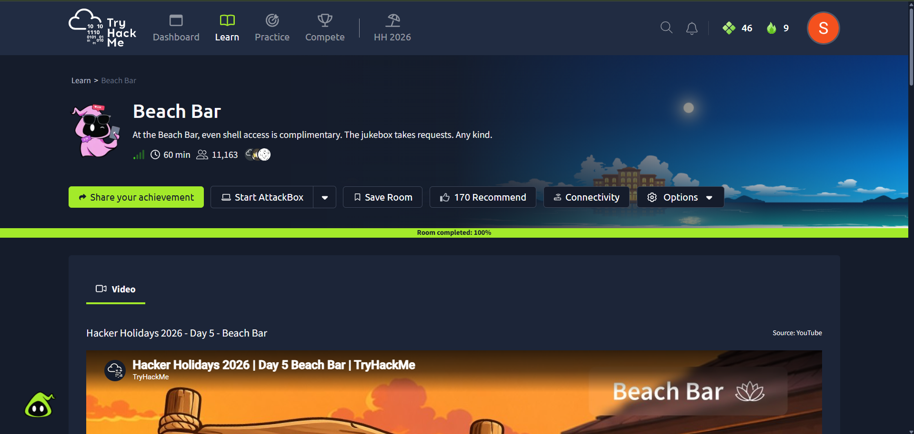
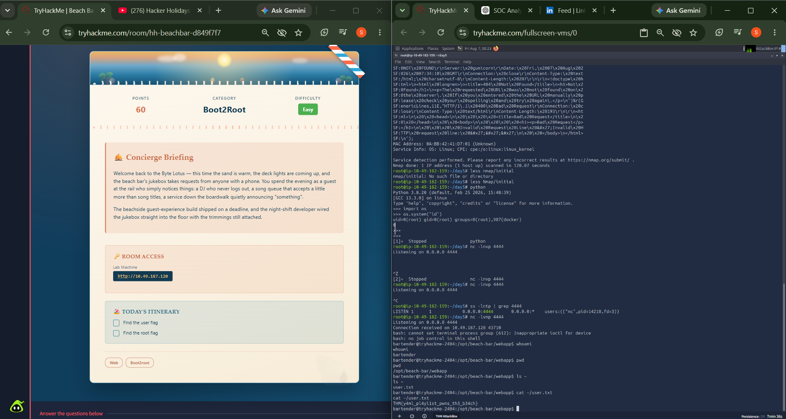
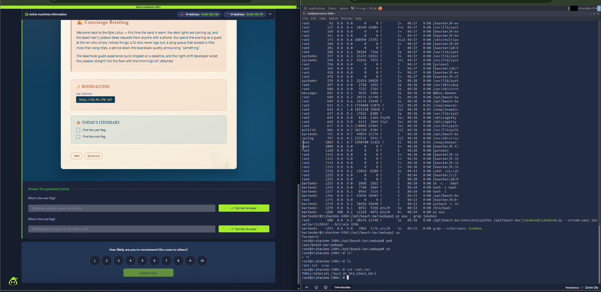

<div align="center">

# 🏖️ Beach Bar - Boot2Root Walkthrough

<p>
  
  
  
</p>

<p>
  
  
  
</p>

<p>
  
  
  
  
</p>

### A Linux Boot2Root challenge focusing on enumeration, web application analysis, privilege escalation, and structured penetration testing methodology.

</div>

---

# 📖 Overview

This repository documents my walkthrough of the **Beach Bar Boot2Root** challenge from **TryHackMe**.

The objective of the challenge was to:

- Perform Linux enumeration
- Analyze the target web application
- Investigate system services
- Identify privilege escalation opportunities
- Obtain administrative (root) access
- Document the complete methodology

Unlike simple CTFs that rely on a single exploit, this room required careful enumeration and understanding of Linux internals before escalating privileges.

---

# 🎯 Objectives

- Gain initial foothold
- Enumerate the Linux system
- Investigate web application behaviour
- Analyze running services
- Escalate privileges
- Obtain root access
- Document findings professionally

---

# 🛠️ Skills Practiced

- Linux Enumeration
- Web Application Analysis
- Linux File Permissions
- Process Enumeration
- Service Enumeration
- Systemd Analysis
- Privilege Escalation
- Reverse Shell Handling
- Bash Scripting
- Python
- Git & GitHub Documentation

---

# 📂 Repository Structure

```text
Beach-Bar/
│
├── README.md
│
├── images/
│   ├── challenge-overview.png
│   ├── user-privilege.png
│   ├── root-privilege.png
│   └── case-study.png

```

---

# 🔍 Methodology

## Phase 1 – Reconnaissance

- Examined the target application
- Identified available functionality
- Explored exposed endpoints

---

## Phase 2 – Enumeration

Performed systematic Linux enumeration:

- User information
- Running processes
- Services
- Network ports
- File permissions
- Installed binaries
- Scheduled tasks
- Environment variables
- Interesting files
- Writable locations

---

## Phase 3 – Initial Access

- Investigated the web application's behaviour
- Obtained an interactive shell
- Stabilized shell access

---

## Phase 4 – Privilege Escalation

Focused on:

- Service analysis
- Linux permissions
- Process ownership
- Misconfigurations
- Executable paths
- Configuration files

Successfully escalated privileges and obtained administrative access.

---

# 📸 Screenshots

## 🏖️ Challenge Overview

Overview of the Beach Bar challenge.



---

## 👤 Initial User Access

Successfully obtained an interactive shell with user privileges.



---

## 👑 Root Access

Successfully escalated privileges and obtained root access.



---

## 📖 Case Study

Summary of the methodology, findings, and lessons learned.


---

# 🧠 Key Learning Outcomes

This challenge improved my understanding of:

- Why enumeration is the most important phase of penetration testing.
- Investigating Linux services before attempting privilege escalation.
- Reading Linux service configurations.
- Identifying privilege escalation vectors.
- Stabilizing reverse shells.
- Thinking methodically instead of relying on automated tools.
- Proper documentation for cybersecurity portfolios.

---

# ⚙️ Tools Used

| Tool | Purpose |
|------|---------|
| Kali Linux | Attacking Machine |
| Bash | Enumeration |
| Python | Payload Handling |
| Linux Utilities | Enumeration |
| Git | Version Control |
| GitHub | Documentation |
| TryHackMe | Training Platform |

---

# 📚 Concepts Covered

- Linux Fundamentals
- File Permissions
- Process Enumeration
- Linux Services
- Systemd
- Reverse Shells
- Privilege Escalation
- Enumeration Methodology
- Security Documentation

---

# 📌 Lessons Learned

✔ Always enumerate before exploiting.

✔ Investigate running services carefully.

✔ Understand Linux permissions.

✔ Document every step clearly.

✔ Practice methodology over memorizing exploits.

---

# 📈 Future Improvements

- Add a full walkthrough PDF.
- Include command explanations.
- Expand privilege escalation notes.
- Add mitigation recommendations.
- Create automation scripts for common enumeration tasks.

---

# 📚 References

- TryHackMe
- GTFOBins
- HackTricks
- Linux Documentation
- OWASP Testing Guide

---

# ⚠️ Disclaimer

This repository has been created **strictly for educational purposes**.

All activities were performed inside an authorized Capture The Flag (CTF) environment provided by **TryHackMe**.

No techniques demonstrated here should be used against systems without explicit authorization.

---

<div align="center">

## 👩‍💻 Author

**Samyuktha Saravanan**

Cybersecurity Learner • Linux Enthusiast • Future Penetration Tester

---

⭐ *If you found this repository helpful, consider starring it!*

**Learning • Building • Securing**

</div>
