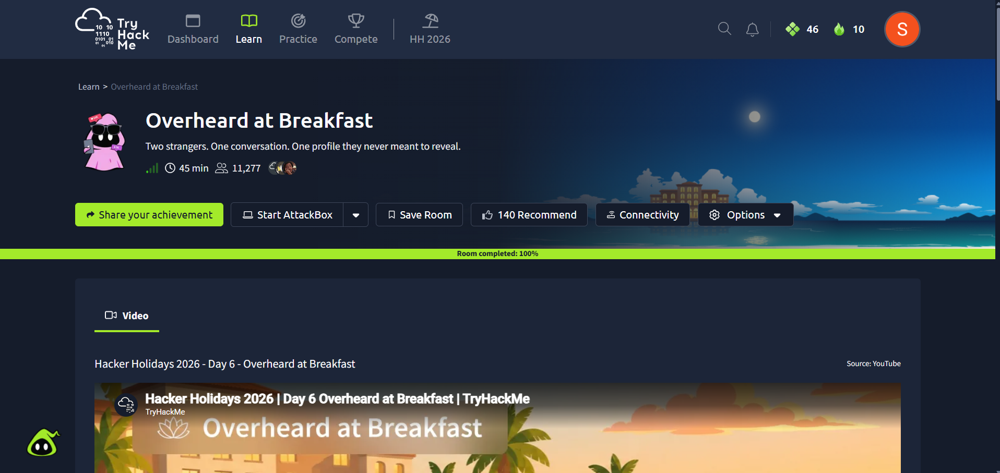
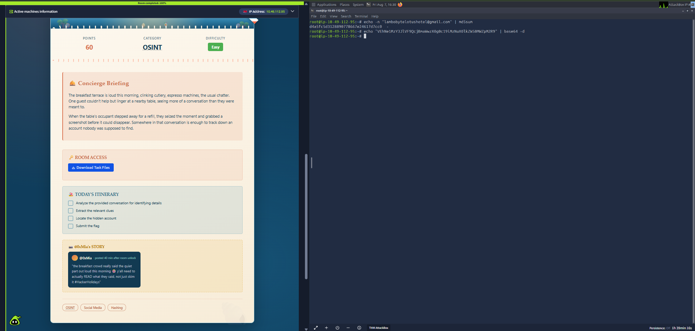
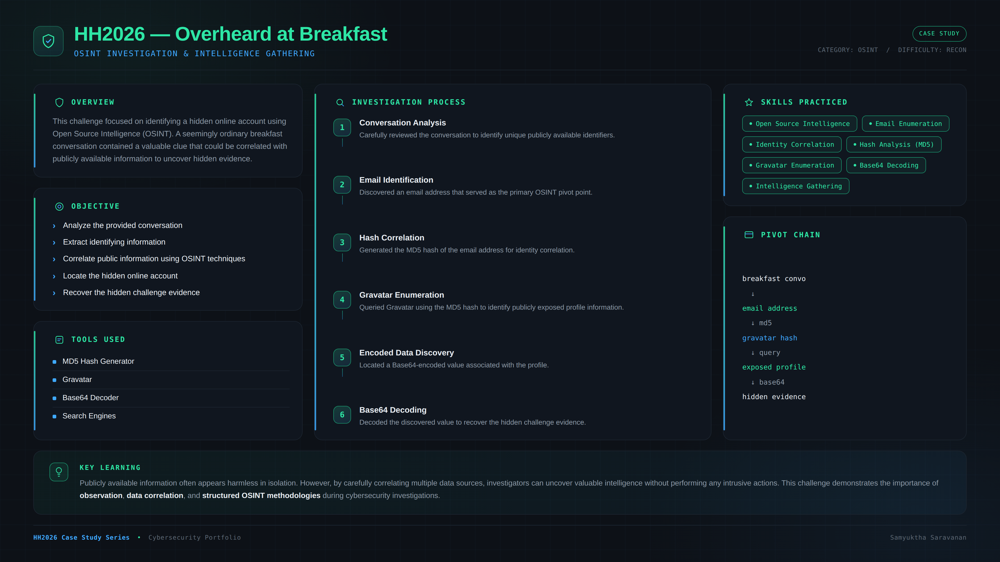

# 🥐 HH2026 – Overheard at Breakfast


---

## 📖 Overview

**Overheard at Breakfast** is an **OSINT (Open Source Intelligence)** challenge from the **Hacker Holidays 2026** event on TryHackMe.

The objective is to investigate a conversation screenshot, identify publicly available information, and use Open Source Intelligence techniques to uncover hidden evidence.

Rather than exploiting a vulnerability, this challenge focuses on **information correlation**, demonstrating how seemingly harmless public information can become valuable intelligence.

---

## 🎯 Objectives

- Analyze the provided conversation.
- Identify valuable OSINT indicators.
- Correlate public information.
- Locate the hidden account.
- Recover the hidden evidence.

---

## 🛠️ Skills Practiced

- Open Source Intelligence (OSINT)
- Email Enumeration
- Identity Correlation
- MD5 Hash Analysis
- Gravatar Enumeration
- Base64 Decoding
- Intelligence Gathering
- Information Correlation

---

## 🔍 Investigation Summary

The investigation followed a structured OSINT workflow:

1. Reviewed the conversation for unique identifiers.
2. Identified an email address that served as the primary intelligence pivot.
3. Generated the MD5 hash of the email.
4. Queried Gravatar using the generated hash.
5. Identified publicly exposed profile information.
6. Located a Base64-encoded value.
7. Decoded the value to recover the hidden challenge evidence.

---

## 🧰 Tools Used

- MD5 Hash Generator
- Gravatar
- Base64 Decoder
- Search Engines

---

## 📂 Repository Structure

```text
HH2026-CS06-Overheard-at-Breakfast
│
├── README.md
│
├── images
│   ├── main-page.png
│   ├── base64-decoding.png
│   └── case-study.png
└── 
```

---

## 🖼️ Screenshots

### 🏨 Room Overview



---

### 🔓 Base64 Decoding



---

### 📄 Professional Case Study



---

## 📚 Key Learning

This challenge demonstrates how attackers and investigators alike can leverage publicly available information to uncover hidden intelligence.

A single email address can become a valuable **OSINT pivot**, leading to additional information through services such as Gravatar. It also reinforces the importance of examining encoded values rather than overlooking them.

---

## ⚠️ Disclaimer

This repository is intended **solely for educational purposes**.

No challenge flags, sensitive information, or private data are disclosed.

---

## 👩‍💻 Author

**Samyuktha Saravanan**

Cybersecurity Learner • OSINT • Blue Team • TryHackMe

🔗 GitHub: https://github.com/samyuktha200512-ops

---

> *Part of my Hacker Holidays 2026 cybersecurity portfolio documenting practical hands-on investigations and professional case studies.*
